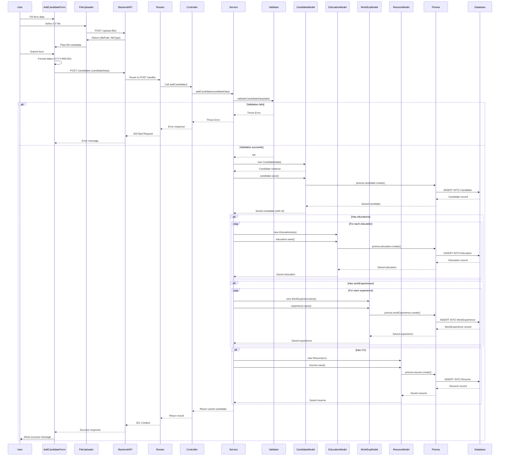

# Feature Analysis: Insert Candidates in the Database

## Executive Summary

This document provides a comprehensive analysis of the "Insert Candidates" feature in the LTI Talent Tracking System. The feature follows a Domain-Driven Design (DDD) layered architecture pattern, implementing a complete flow from user interface to database persistence.

**Feature Scope**: Allows recruiters to create new candidate profiles with associated education history, work experience, and CV/resume documents through a web interface.

---

## Table of Contents

1. [Architecture Overview](#architecture-overview)
2. [Layer-by-Layer Component Analysis](#layer-by-layer-component-analysis)
3. [Data Flow Diagram](#data-flow-diagram)
4. [Component Interaction Diagram](#component-interaction-diagram)
5. [Sequence Diagram](#sequence-diagram)
6. [Database Schema](#database-schema)
7. [API Endpoints](#api-endpoints)
8. [Validation Rules](#validation-rules)
9. [Error Handling](#error-handling)
10. [Dependencies](#dependencies)

---

## Architecture Overview

The "Insert Candidates" feature follows a **Layered Architecture** pattern with clear separation of concerns:

```
┌─────────────────────────────────────────────────────────────┐
│                    Frontend Layer                           │
│  (React Components, User Interface, API Client)            │
├─────────────────────────────────────────────────────────────┤
│                 Presentation Layer                          │
│         (Routes, Controllers, HTTP Handlers)                │
├─────────────────────────────────────────────────────────────┤
│                 Application Layer                           │
│          (Services, Validators, Business Logic)              │
├─────────────────────────────────────────────────────────────┤
│                    Domain Layer                             │
│         (Domain Models, Business Entities)                  │
├─────────────────────────────────────────────────────────────┤
│                Infrastructure Layer                         │
│         (Prisma ORM, Database, File System)                 │
└─────────────────────────────────────────────────────────────┘
```

---

## Layer-by-Layer Component Analysis

### 1. Frontend Layer

**Purpose**: Provides the user interface for candidate data entry and handles user interactions.

#### Components Involved:

##### 1.1 `frontend/src/components/AddCandidateForm.js`
- **Type**: React Functional Component
- **Responsibility**: 
  - Renders the candidate registration form
  - Manages form state (firstName, lastName, email, phone, address, educations, workExperiences, cv)
  - Handles form submission
  - Formats data before sending to API
  - Displays success/error messages
- **Key Functions**:
  - `handleInputChange()`: Updates form field values
  - `handleDateChange()`: Manages date picker changes
  - `handleAddSection()`: Adds new education/work experience entries
  - `handleRemoveSection()`: Removes education/work experience entries
  - `handleCVUpload()`: Receives CV data from FileUploader
  - `handleSubmit()`: Submits candidate data to backend API
- **API Integration**: Direct fetch call to `POST http://localhost:3010/candidates`
- **Dependencies**: 
  - React Bootstrap components
  - `FileUploader` component
  - `react-datepicker` library

##### 1.2 `frontend/src/components/FileUploader.js`
- **Type**: React Functional Component
- **Responsibility**:
  - Provides file selection UI
  - Handles file upload to backend
  - Manages upload state (loading, success, error)
  - Returns file metadata (filePath, fileType) to parent component
- **Key Functions**:
  - `handleFileChange()`: Captures selected file
  - `handleFileUpload()`: Uploads file to `/upload` endpoint
- **API Integration**: `POST http://localhost:3010/upload`
- **Dependencies**: React Bootstrap components

##### 1.3 `frontend/src/services/candidateService.js` (Available but not directly used)
- **Type**: Service Module
- **Responsibility**: Provides abstraction layer for API calls (currently not used by AddCandidateForm)
- **Functions**: `uploadCV()`, `sendCandidateData()`

---

### 2. Presentation Layer (Backend)

**Purpose**: Handles HTTP requests, routes them to appropriate handlers, and formats HTTP responses.

#### Components Involved:

##### 2.1 `backend/src/routes/candidateRoutes.ts`
- **Type**: Express Router Module
- **Responsibility**:
  - Defines the `/candidates` route
  - Maps `POST /` to controller function
  - Handles HTTP-level error responses
- **Route Definition**: 
  ```typescript
  router.post('/', async (req, res) => {
    const result = await addCandidate(req.body);
    res.status(201).send(result);
  });
  ```
- **Error Handling**: 
  - 400 Bad Request for validation errors
  - 500 Internal Server Error for unexpected errors
- **Dependencies**: Express Router, `candidateController`

##### 2.2 `backend/src/presentation/controllers/candidateController.ts`
- **Type**: Controller Module
- **Responsibility**:
  - Receives HTTP request data
  - Invokes application service
  - Formats HTTP responses
  - Handles controller-level error responses
- **Key Function**: `addCandidateController()`
- **Exports**: 
  - `addCandidateController`: Controller function (not currently used by routes)
  - `addCandidate`: Re-exported service function (used by routes)
- **Dependencies**: Express Request/Response types, `candidateService`

**Note**: There's a slight architectural inconsistency here. The route directly calls the service function (`addCandidate`) instead of using the controller (`addCandidateController`). The controller exists but is not wired up.

---

### 3. Application Layer

**Purpose**: Orchestrates business logic, validates input data, and coordinates domain model operations.

#### Components Involved:

##### 3.1 `backend/src/application/services/candidateService.ts`
- **Type**: Application Service
- **Responsibility**:
  - Orchestrates the candidate creation workflow
  - Coordinates creation of Candidate and related entities (Education, WorkExperience, Resume)
  - Handles business-level error scenarios (e.g., duplicate email)
  - Manages transaction-like operations
- **Key Function**: `addCandidate(candidateData: any)`
- **Workflow**:
  1. Validates candidate data using `validateCandidateData()`
  2. Creates `Candidate` domain model instance
  3. Saves candidate to database
  4. Creates related `Education` records (if provided)
  5. Creates related `WorkExperience` records (if provided)
  6. Creates `Resume` record (if CV provided)
  7. Returns saved candidate
- **Error Handling**:
  - Validation errors: Throws Error with validation message
  - Database errors: Handles Prisma error code `P2002` (unique constraint violation for email)
- **Dependencies**: 
  - `validator.ts`
  - Domain models: `Candidate`, `Education`, `WorkExperience`, `Resume`

##### 3.2 `backend/src/application/validator.ts`
- **Type**: Validation Module
- **Responsibility**:
  - Validates all candidate input data according to business rules
  - Enforces data format, length, and pattern constraints
  - Provides centralized validation logic
- **Key Function**: `validateCandidateData(data: any)`
- **Validation Functions**:
  - `validateName()`: Name format and length (2-100 chars, letters only)
  - `validateEmail()`: Email format validation
  - `validatePhone()`: Spanish phone format (9 digits, starts with 6/7/9)
  - `validateDate()`: Date format (YYYY-MM-DD)
  - `validateAddress()`: Address length (max 100 chars)
  - `validateEducation()`: Education record validation
  - `validateExperience()`: Work experience validation
  - `validateCV()`: CV/resume data validation
- **Validation Rules**: See [Validation Rules](#validation-rules) section
- **Dependencies**: None (pure validation functions)

##### 3.3 `backend/src/application/services/fileUploadService.ts`
- **Type**: Application Service
- **Responsibility**:
  - Handles file upload operations
  - Validates file type (PDF, DOCX only)
  - Validates file size (max 10MB)
  - Stores files on filesystem
  - Returns file metadata (path, type)
- **Key Function**: `uploadFile(req: Request, res: Response)`
- **Configuration**:
  - Storage: `../uploads/` directory
  - File naming: `{timestamp}-{originalname}`
  - Allowed types: `application/pdf`, `application/vnd.openxmlformats-officedocument.wordprocessingml.document`
- **Dependencies**: Multer middleware, Express Request/Response

**Note**: File upload is a separate endpoint (`/upload`) that is called before candidate creation. The file metadata is then included in the candidate data.

---

### 4. Domain Layer

**Purpose**: Represents business entities and encapsulates domain logic and persistence behavior.

#### Components Involved:

##### 4.1 `backend/src/domain/models/Candidate.ts`
- **Type**: Domain Model (Active Record Pattern)
- **Responsibility**:
  - Represents the Candidate entity
  - Encapsulates candidate data and behavior
  - Handles persistence operations via Prisma
  - Manages relationships with Education, WorkExperience, Resume
- **Properties**:
  - `id?: number`
  - `firstName: string`
  - `lastName: string`
  - `email: string`
  - `phone?: string`
  - `address?: string`
  - `education: Education[]`
  - `workExperience: WorkExperience[]`
  - `resumes: Resume[]`
- **Key Methods**:
  - `constructor(data: any)`: Creates Candidate instance from data
  - `async save()`: Persists candidate to database (create or update)
  - `static async findOne(id: number)`: Retrieves candidate by ID
- **Persistence Logic**:
  - Uses Prisma Client for database operations
  - Handles create vs update based on `id` presence
  - Supports nested creation of related entities
  - Error handling for database connection and constraint violations
- **Dependencies**: Prisma Client, `Education`, `WorkExperience`, `Resume` models

##### 4.2 `backend/src/domain/models/Education.ts`
- **Type**: Domain Model (Active Record Pattern)
- **Responsibility**:
  - Represents Education entity
  - Encapsulates education data and persistence
- **Properties**:
  - `id?: number`
  - `institution: string`
  - `title: string`
  - `startDate: Date`
  - `endDate?: Date`
  - `candidateId?: number`
- **Key Methods**:
  - `constructor(data: any)`: Creates Education instance
  - `async save()`: Persists education record
- **Dependencies**: Prisma Client

##### 4.3 `backend/src/domain/models/WorkExperience.ts`
- **Type**: Domain Model (Active Record Pattern)
- **Responsibility**:
  - Represents WorkExperience entity
  - Encapsulates work experience data and persistence
- **Properties**:
  - `id?: number`
  - `company: string`
  - `position: string`
  - `description?: string`
  - `startDate: Date`
  - `endDate?: Date`
  - `candidateId?: number`
- **Key Methods**:
  - `constructor(data: any)`: Creates WorkExperience instance
  - `async save()`: Persists work experience record
- **Dependencies**: Prisma Client

##### 4.4 `backend/src/domain/models/Resume.ts`
- **Type**: Domain Model (Active Record Pattern)
- **Responsibility**:
  - Represents Resume/CV entity
  - Encapsulates resume data and persistence
  - Enforces immutability (no updates allowed)
- **Properties**:
  - `id: number`
  - `candidateId: number`
  - `filePath: string`
  - `fileType: string`
  - `uploadDate: Date`
- **Key Methods**:
  - `constructor(data: any)`: Creates Resume instance
  - `async save()`: Persists resume record (delegates to `create()`)
  - `async create()`: Creates new resume record
- **Business Rule**: Resume records are immutable after creation
- **Dependencies**: Prisma Client

---

### 5. Infrastructure Layer

**Purpose**: Provides technical capabilities for database access, file storage, and external system integration.

#### Components Involved:

##### 5.1 Prisma ORM (`@prisma/client`)
- **Type**: Object-Relational Mapping Framework
- **Responsibility**:
  - Provides type-safe database access
  - Generates database client from schema
  - Handles database connections
  - Executes SQL queries
  - Manages transactions
- **Usage**: 
  - Instantiated as `PrismaClient` in domain models
  - Used for all database operations (create, update, find)
- **Configuration**: Defined in `backend/prisma/schema.prisma`

##### 5.2 `backend/prisma/schema.prisma`
- **Type**: Database Schema Definition
- **Responsibility**:
  - Defines database structure
  - Specifies relationships between entities
  - Enforces constraints (unique, foreign keys)
  - Generates Prisma Client
- **Models Defined**:
  - `Candidate`: Main entity with unique email constraint
  - `Education`: Related entity with foreign key to Candidate
  - `WorkExperience`: Related entity with foreign key to Candidate
  - `Resume`: Related entity with foreign key to Candidate
- **Database**: PostgreSQL
- **Relationships**:
  - Candidate 1:N Education
  - Candidate 1:N WorkExperience
  - Candidate 1:N Resume

##### 5.3 PostgreSQL Database
- **Type**: Relational Database Management System
- **Responsibility**:
  - Stores candidate data persistently
  - Enforces data integrity constraints
  - Provides ACID transaction guarantees
- **Configuration**: Managed via Docker Compose
- **Connection**: Configured via `DATABASE_URL` environment variable

##### 5.4 File System (`../uploads/`)
- **Type**: Local File Storage
- **Responsibility**:
  - Stores uploaded CV/resume files
  - Provides file path references for Resume records
- **Configuration**: Managed by Multer disk storage
- **Location**: Relative path `../uploads/` from backend root

##### 5.5 Express.js Framework
- **Type**: Web Application Framework
- **Responsibility**:
  - Handles HTTP requests/responses
  - Provides routing capabilities
  - Manages middleware pipeline
  - Serves as web server
- **Configuration**: Defined in `backend/src/index.ts`
- **Port**: 3010

##### 5.6 Multer Middleware
- **Type**: File Upload Middleware
- **Responsibility**:
  - Handles multipart/form-data requests
  - Manages file uploads
  - Validates file types and sizes
- **Configuration**: Defined in `fileUploadService.ts`

---

## Data Flow Diagram

```
┌─────────────────────────────────────────────────────────────────┐
│                         USER                                    │
└───────────────────────┬─────────────────────────────────────────┘
                        │
                        │ 1. Fill Form & Upload CV
                        ▼
┌─────────────────────────────────────────────────────────────────┐
│                    FRONTEND LAYER                               │
│  ┌──────────────────┐         ┌──────────────────┐            │
│  │ AddCandidateForm │─────────▶│  FileUploader   │            │
│  │                 │          │                  │            │
│  │ - Form State    │          │ - File Selection│            │
│  │ - Validation    │          │ - Upload Handler │            │
│  └────────┬─────────┘          └────────┬─────────┘            │
│           │                             │                      │
│           │ 2. POST /upload             │                      │
│           │                             │                      │
└───────────┼─────────────────────────────┼──────────────────────┘
            │                             │
            │                             │ 3. Returns filePath, fileType
            │                             │
            │ 4. POST /candidates (with CV metadata)
            │
            ▼
┌─────────────────────────────────────────────────────────────────┐
│                PRESENTATION LAYER                                │
│  ┌──────────────────┐         ┌──────────────────┐            │
│  │ candidateRoutes │─────────▶│candidateController│            │
│  │                 │          │                  │            │
│  │ - Route Handler │          │ - Request Handler│            │
│  │ - Error Handler │          │ - Response Format│            │
│  └─────────────────┘          └────────┬─────────┘            │
└─────────────────────────────────────────┼──────────────────────┘
                                           │
                                           │ 5. Invoke Service
                                           ▼
┌─────────────────────────────────────────────────────────────────┐
│                 APPLICATION LAYER                                │
│  ┌──────────────────┐         ┌──────────────────┐            │
│  │ candidateService │─────────▶│    validator     │            │
│  │                 │          │                  │            │
│  │ - Orchestration │          │ - Input Validation│           │
│  │ - Business Logic│          │ - Rule Enforcement│           │
│  └────────┬────────┘          └──────────────────┘            │
│           │                                                    │
│           │ 6. Create Domain Models                           │
│           │                                                    │
└───────────┼────────────────────────────────────────────────────┘
            │
            ▼
┌─────────────────────────────────────────────────────────────────┐
│                     DOMAIN LAYER                                │
│  ┌──────────┐  ┌──────────┐  ┌──────────┐  ┌──────────┐     │
│  │Candidate │  │Education │  │WorkExp   │  │ Resume   │     │
│  │          │  │          │  │          │  │          │     │
│  │- save()  │  │- save()  │  │- save()  │  │- save()  │     │
│  └────┬─────┘  └────┬─────┘  └────┬─────┘  └────┬─────┘     │
│       │             │             │             │            │
└───────┼─────────────┼─────────────┼─────────────┼────────────┘
        │             │             │             │
        │ 7. Persist via Prisma ORM
        │
        ▼
┌─────────────────────────────────────────────────────────────────┐
│              INFRASTRUCTURE LAYER                               │
│  ┌──────────────────┐         ┌──────────────────┐            │
│  │  Prisma Client   │────────▶│   PostgreSQL     │            │
│  │                 │          │   Database       │            │
│  │ - Type-safe     │          │                  │            │
│  │ - Query Builder │          │ - Data Storage   │            │
│  └─────────────────┘          └──────────────────┘            │
└─────────────────────────────────────────────────────────────────┘
```

---

## Component Interaction Diagram

```
┌──────────────┐
│   Frontend   │
│  Components  │
└──────┬───────┘
       │
       │ HTTP POST
       │
       ▼
┌─────────────────────────────────────────────────────────────┐
│                    Presentation Layer                       │
│  ┌─────────────────┐              ┌──────────────────┐     │
│  │ candidateRoutes │──────────────▶│candidateController│     │
│  │  (Express)     │               │  (Controller)   │     │
│  └─────────────────┘               └────────┬─────────┘     │
└──────────────────────────────────────────────┼──────────────┘
                                               │
                                               │ Service Call
                                               ▼
┌─────────────────────────────────────────────────────────────┐
│                   Application Layer                        │
│  ┌─────────────────┐              ┌──────────────────┐     │
│  │candidateService │──────────────▶│    validator     │     │
│  │  (Service)     │               │  (Validation)   │     │
│  └────────┬───────┘               └──────────────────┘     │
│           │                                                 │
│           │ Create Domain Models                           │
│           │                                                 │
└───────────┼─────────────────────────────────────────────────┘
            │
            ├─────────────────┬──────────────────┬──────────┐
            │                 │                  │          │
            ▼                 ▼                  ▼          ▼
┌─────────────────────────────────────────────────────────────┐
│                      Domain Layer                           │
│  ┌──────────┐  ┌──────────┐  ┌──────────┐  ┌──────────┐  │
│  │Candidate │  │Education │  │WorkExp   │  │ Resume   │  │
│  │  Model   │  │  Model   │  │  Model   │  │  Model   │  │
│  └────┬─────┘  └────┬─────┘  └────┬─────┘  └────┬─────┘  │
└───────┼─────────────┼─────────────┼─────────────┼─────────┘
        │             │             │             │
        │             │             │             │
        └─────────────┴─────────────┴─────────────┘
                      │
                      │ Prisma ORM Calls
                      ▼
┌─────────────────────────────────────────────────────────────┐
│                 Infrastructure Layer                         │
│  ┌─────────────────┐              ┌──────────────────┐     │
│  │  Prisma Client  │──────────────▶│   PostgreSQL     │     │
│  │   (ORM)        │               │   Database       │     │
│  └─────────────────┘               └──────────────────┘     │
└─────────────────────────────────────────────────────────────┘
```

---

## Sequence Diagram



---

## Database Schema

### Entity Relationship Diagram

```
┌─────────────────────────────────────────────────────────────┐
│                        Candidate                            │
├─────────────────────────────────────────────────────────────┤
│ id                INT (PK, Auto-increment)                  │
│ firstName         VARCHAR(100) NOT NULL                    │
│ lastName          VARCHAR(100) NOT NULL                     │
│ email             VARCHAR(255) NOT NULL UNIQUE              │
│ phone             VARCHAR(15)                              │
│ address           VARCHAR(100)                              │
└───────┬─────────────────────────────────────────────────────┘
        │
        │ 1:N Relationships
        │
        ├──────────────────┬──────────────────┬──────────────┐
        │                  │                  │              │
        ▼                  ▼                  ▼              ▼
┌──────────────┐  ┌──────────────┐  ┌──────────────┐  ┌──────────────┐
│  Education   │  │WorkExperience│  │   Resume     │  │   (Future)   │
├──────────────┤  ├──────────────┤  ├──────────────┤  │              │
│ id (PK)      │  │ id (PK)      │  │ id (PK)      │  │              │
│ candidateId  │  │ candidateId  │  │ candidateId  │  │              │
│ (FK)         │  │ (FK)         │  │ (FK)         │  │              │
│ institution  │  │ company      │  │ filePath     │  │              │
│ title        │  │ position     │  │ fileType     │  │              │
│ startDate    │  │ description  │  │ uploadDate   │  │              │
│ endDate      │  │ startDate    │  └──────────────┘  │              │
└──────────────┘  │ endDate      │                    │              │
                 └──────────────┘                    └──────────────┘
```

### Schema Definition (Prisma)

```prisma
model Candidate {
  id                Int               @id @default(autoincrement())
  firstName         String            @db.VarChar(100)
  lastName          String            @db.VarChar(100)
  email             String            @unique @db.VarChar(255)
  phone             String?           @db.VarChar(15)
  address           String?           @db.VarChar(100)
  educations        Education[]
  workExperiences   WorkExperience[]
  resumes           Resume[]
}

model Education {
  id            Int       @id @default(autoincrement())
  institution   String    @db.VarChar(100)
  title         String    @db.VarChar(250)
  startDate     DateTime
  endDate       DateTime?
  candidateId   Int
  candidate     Candidate @relation(fields: [candidateId], references: [id])
}

model WorkExperience {
  id          Int       @id @default(autoincrement())
  company     String    @db.VarChar(100)
  position    String    @db.VarChar(100)
  description String?   @db.VarChar(200)
  startDate   DateTime
  endDate     DateTime?
  candidateId Int
  candidate   Candidate @relation(fields: [candidateId], references: [id])
}

model Resume {
  id          Int       @id @default(autoincrement())
  filePath    String    @db.VarChar(500)
  fileType    String    @db.VarChar(50)
  uploadDate  DateTime
  candidateId Int
  candidate   Candidate @relation(fields: [candidateId], references: [id])
}
```

---

## API Endpoints

### POST `/candidates`

**Purpose**: Create a new candidate profile with associated data.

**Request**:
- **Method**: `POST`
- **URL**: `http://localhost:3010/candidates`
- **Headers**: `Content-Type: application/json`
- **Body**: JSON object containing candidate data

**Request Body Schema**:
```json
{
  "firstName": "string (2-100 chars, letters only)",
  "lastName": "string (2-100 chars, letters only)",
  "email": "string (valid email format, unique)",
  "phone": "string (9 digits, starts with 6/7/9, optional)",
  "address": "string (max 100 chars, optional)",
  "educations": [
    {
      "institution": "string (max 100 chars, required)",
      "title": "string (max 100 chars, required)",
      "startDate": "YYYY-MM-DD (required)",
      "endDate": "YYYY-MM-DD (optional)"
    }
  ],
  "workExperiences": [
    {
      "company": "string (max 100 chars, required)",
      "position": "string (max 100 chars, required)",
      "description": "string (max 200 chars, optional)",
      "startDate": "YYYY-MM-DD (required)",
      "endDate": "YYYY-MM-DD (optional)"
    }
  ],
  "cv": {
    "filePath": "string (required)",
    "fileType": "string (MIME type, required)"
  }
}
```

**Response**:
- **201 Created**: Candidate created successfully
  ```json
  {
    "id": 1,
    "firstName": "John",
    "lastName": "Doe",
    "email": "john.doe@example.com",
    ...
  }
  ```
- **400 Bad Request**: Validation error or duplicate email
  ```json
  {
    "message": "Error message"
  }
  ```
- **500 Internal Server Error**: Server error

### POST `/upload`

**Purpose**: Upload a CV/resume file (called before candidate creation).

**Request**:
- **Method**: `POST`
- **URL**: `http://localhost:3010/upload`
- **Headers**: `Content-Type: multipart/form-data`
- **Body**: Form data with `file` field

**Constraints**:
- Allowed file types: PDF (`application/pdf`), DOCX (`application/vnd.openxmlformats-officedocument.wordprocessingml.document`)
- Max file size: 10MB
- Storage location: `../uploads/` directory

**Response**:
- **200 OK**: File uploaded successfully
  ```json
  {
    "filePath": "../uploads/1234567890-resume.pdf",
    "fileType": "application/pdf"
  }
  ```
- **400 Bad Request**: Invalid file type
- **500 Internal Server Error**: Upload error

---

## Validation Rules

### Candidate-Level Validation

| Field | Rules | Error Message |
|-------|-------|---------------|
| `firstName` | Required, 2-100 chars, letters only (including Spanish characters) | "Invalid name" |
| `lastName` | Required, 2-100 chars, letters only (including Spanish characters) | "Invalid name" |
| `email` | Required, valid email format, unique (enforced at DB level) | "Invalid email" |
| `phone` | Optional, 9 digits, starts with 6/7/9 | "Invalid phone" |
| `address` | Optional, max 100 chars | "Invalid address" |

### Education Validation

| Field | Rules | Error Message |
|-------|-------|---------------|
| `institution` | Required, max 100 chars | "Invalid institution" |
| `title` | Required, max 100 chars | "Invalid title" |
| `startDate` | Required, YYYY-MM-DD format | "Invalid date" |
| `endDate` | Optional, YYYY-MM-DD format | "Invalid end date" |

### Work Experience Validation

| Field | Rules | Error Message |
|-------|-------|---------------|
| `company` | Required, max 100 chars | "Invalid company" |
| `position` | Required, max 100 chars | "Invalid position" |
| `description` | Optional, max 200 chars | "Invalid description" |
| `startDate` | Required, YYYY-MM-DD format | "Invalid date" |
| `endDate` | Optional, YYYY-MM-DD format | "Invalid end date" |

### CV/Resume Validation

| Field | Rules | Error Message |
|-------|-------|---------------|
| `filePath` | Required, string | "Invalid CV data" |
| `fileType` | Required, string (MIME type) | "Invalid CV data" |
| File Type | PDF or DOCX only | "Invalid file type, only PDF and DOCX are allowed!" |
| File Size | Max 10MB | Multer error |

### Validation Patterns

```typescript
// Name pattern: Letters, spaces, Spanish characters
NAME_REGEX = /^[a-zA-ZñÑáéíóúÁÉÍÓÚ ]+$/

// Email pattern: Standard email format
EMAIL_REGEX = /^[a-zA-Z0-9._%+-]+@[a-zA-Z0-9.-]+\.[a-zA-Z]{2,}$/

// Phone pattern: Spanish mobile (9 digits, starts with 6/7/9)
PHONE_REGEX = /^(6|7|9)\d{8}$/

// Date pattern: YYYY-MM-DD
DATE_REGEX = /^\d{4}-\d{2}-\d{2}$/
```

---

## Error Handling

### Error Flow

```
┌─────────────────────────────────────────────────────────────┐
│                    Error Sources                             │
├─────────────────────────────────────────────────────────────┤
│ 1. Validation Errors (validator.ts)                        │
│ 2. Database Errors (Prisma)                                 │
│    - P2002: Unique constraint violation (duplicate email)   │
│    - P2025: Record not found                                │
│    - PrismaClientInitializationError: DB connection failure │
│ 3. File Upload Errors (Multer)                              │
│    - Invalid file type                                      │
│    - File size exceeded                                     │
│ 4. Generic Errors                                           │
└─────────────────────────────────────────────────────────────┘
```

### Error Handling by Layer

#### Frontend Layer
- **Location**: `AddCandidateForm.js`
- **Strategy**: Try-catch in `handleSubmit()`
- **User Feedback**: 
  - Error alerts via React Bootstrap `Alert` component
  - Success messages for successful operations
- **Error Display**: `setError()` updates state, displayed in UI

#### Presentation Layer
- **Location**: `candidateRoutes.ts`, `candidateController.ts`
- **Strategy**: Try-catch blocks, error type checking
- **HTTP Status Codes**:
  - `400 Bad Request`: Validation errors, duplicate email
  - `500 Internal Server Error`: Unexpected errors
- **Response Format**: `{ message: string }` or `{ message: string, error: string }`

#### Application Layer
- **Location**: `candidateService.ts`
- **Strategy**: 
  - Validation errors: Thrown immediately
  - Database errors: Caught and transformed
  - P2002 (duplicate email): Transformed to user-friendly message
- **Error Transformation**: Prisma errors → User-friendly messages

#### Domain Layer
- **Location**: Domain models (`Candidate.ts`, etc.)
- **Strategy**: 
  - Prisma errors caught in `save()` methods
  - Error codes checked and transformed
  - Connection errors handled with Spanish messages
- **Error Propagation**: Errors thrown to application layer

#### Infrastructure Layer
- **Location**: Prisma Client, Multer
- **Strategy**: 
  - Prisma: Throws typed errors (PrismaClientKnownRequestError)
  - Multer: Throws MulterError for file-related issues
- **Error Types**: Standardized error codes (P2002, P2025, etc.)

### Error Response Examples

**Validation Error**:
```json
{
  "message": "Error adding candidate",
  "error": "Invalid email"
}
```

**Duplicate Email Error**:
```json
{
  "message": "Error adding candidate",
  "error": "The email already exists in the database"
}
```

**Database Connection Error**:
```json
{
  "message": "Error adding candidate",
  "error": "No se pudo conectar con la base de datos. Por favor, asegúrese de que el servidor de base de datos esté en ejecución."
}
```

---

## Dependencies

### Frontend Dependencies

| Package | Version | Purpose |
|---------|---------|---------|
| `react` | 18.3.1 | UI framework |
| `react-bootstrap` | 2.10.2 | UI components |
| `react-datepicker` | 6.9.0 | Date picker component |
| `axios` | (available) | HTTP client (optional) |

### Backend Dependencies

| Package | Version | Purpose |
|---------|---------|---------|
| `express` | 4.19.2 | Web framework |
| `typescript` | 4.9.5 | Type system |
| `@prisma/client` | 5.13.0 | ORM client |
| `prisma` | 5.13.0 | Prisma CLI |
| `multer` | 1.4.5-lts.1 | File upload middleware |
| `cors` | (latest) | CORS middleware |
| `dotenv` | (latest) | Environment variables |

### Infrastructure Dependencies

| Component | Version | Purpose |
|-----------|---------|---------|
| `postgresql` | (Docker) | Database |
| `node` | (latest) | Runtime environment |

---

## Summary

### Components Summary by Layer

| Layer | Component | File Path | Responsibility |
|-------|-----------|-----------|----------------|
| **Frontend** | AddCandidateForm | `frontend/src/components/AddCandidateForm.js` | Form UI and state management |
| **Frontend** | FileUploader | `frontend/src/components/FileUploader.js` | File upload UI and handling |
| **Presentation** | candidateRoutes | `backend/src/routes/candidateRoutes.ts` | Route definition and HTTP handling |
| **Presentation** | candidateController | `backend/src/presentation/controllers/candidateController.ts` | Request/response handling |
| **Application** | candidateService | `backend/src/application/services/candidateService.ts` | Business logic orchestration |
| **Application** | validator | `backend/src/application/validator.ts` | Input validation |
| **Application** | fileUploadService | `backend/src/application/services/fileUploadService.ts` | File upload handling |
| **Domain** | Candidate | `backend/src/domain/models/Candidate.ts` | Candidate entity and persistence |
| **Domain** | Education | `backend/src/domain/models/Education.ts` | Education entity and persistence |
| **Domain** | WorkExperience | `backend/src/domain/models/WorkExperience.ts` | Work experience entity and persistence |
| **Domain** | Resume | `backend/src/domain/models/Resume.ts` | Resume entity and persistence |
| **Infrastructure** | Prisma Schema | `backend/prisma/schema.prisma` | Database schema definition |
| **Infrastructure** | Prisma Client | `@prisma/client` | Database access layer |
| **Infrastructure** | PostgreSQL | Docker container | Database storage |
| **Infrastructure** | Express | `express` | Web server framework |
| **Infrastructure** | Multer | `multer` | File upload middleware |

### Key Architectural Patterns

1. **Layered Architecture**: Clear separation between presentation, application, domain, and infrastructure
2. **Active Record Pattern**: Domain models encapsulate data and persistence logic
3. **Service Layer Pattern**: Application services orchestrate business logic
4. **Validation Layer**: Centralized validation logic in application layer
5. **Repository Pattern**: Prisma Client acts as repository abstraction

### Data Flow Summary

1. **User Input** → Frontend form collects candidate data
2. **File Upload** → CV file uploaded separately, metadata returned
3. **HTTP Request** → Form data sent to backend API
4. **Routing** → Express routes request to controller
5. **Validation** → Application layer validates input
6. **Domain Models** → Service creates domain model instances
7. **Persistence** → Domain models save to database via Prisma
8. **Response** → Success/error response returned to frontend

---

**Document Version**: 1.0  
**Last Updated**: 2024  
**Feature**: Insert Candidates in Database  
**System**: LTI - Talent Tracking System


